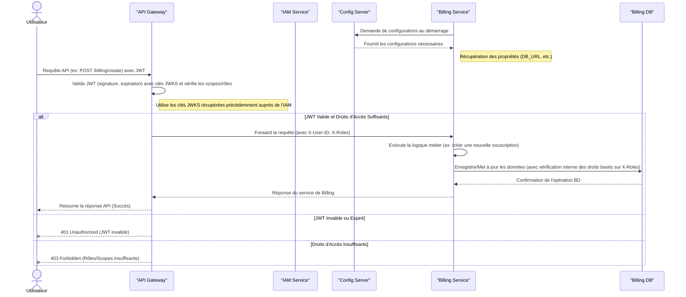

# amcloud-billing

## Description
amcloud-billing is the Billing microservice for the amcloud-platform ecosystem.  
It handles billing creation, updates, and retrieval, enabling seamless integration with other microservices.

## Prerequisites

- Java JDK 17 or higher
- Maven 3.9+
- PostgreSQL (default database service) must be running and correctly configured
- [Optional] Docker (for deployment)
- Git

## Repository Structure

```
amcloud-billing/
├── backend/                      # Main Spring Boot Billing source code
│   ├── src/
│   │   ├── main/
│   │   │   ├── java/cm/amcloud/platform/billing/
│   │   │   │   ├── config/       # Configuration classes (e.g., database)
│   │   │   │   ├── service/      # Business logic and service layer
│   │   │   │   ├── controller/   # REST API controllers
│   │   │   │   ├── repository/   # Data access layer (JPA repositories)
│   │   │   │   ├── dto/          # Data Transfer Objects
│   │   │   │   ├── model/        # Entity classes (database models)
│   │   ├── resources/            # Application resources (e.g., .env, SQL scripts)
│   │   │   ├── schema.sql        # Database schema
│   │   │   ├── data.sql          # Initial data for the database
│   │   │   ├── application.yml   # Spring Boot configuration
│   │   │   ├── application.properties # Additional properties
│   │   ├── test/                 # Unit and integration tests
│   ├── pom.xml                   # Maven configuration file
│   ├── Dockerfile                # Docker configuration for the Billing service
│   ├── mvnw                      # Maven wrapper script (Linux/Mac)
│   ├── mvnw.cmd                  # Maven wrapper script (Windows)
│   ├── .mvn/                     # Maven wrapper configuration
│   ├── .gitignore                # Git ignore file
│   ├── LICENSE                   # License file
│   ├── README.md                 # Project overview and instructions
├── .github/                      # GitHub workflows, issue templates, etc.
├── docs/                         # Documentation and diagrams
└── README.md
```

## Environment Configuration

A `.env` file **must** be present at the root of `backend/` before running or testing the microservice.  
Example content:

```
# Environment variables for the Billing service
BILLING_SERVER_PORT=8082

# === Database config
BILLING_DB_URL=jdbc:postgresql://localhost:5432/amcloud_billing_db
BILLING_DB_USERNAME=amcloud_admin
BILLING_DB_PASSWORD=amcloud_pass
BILLING_DB_DRIVER_CLASS_NAME=org.postgresql.Driver
JPA_DATABASE_PLATFORM=org.hibernate.dialect.PostgreSQLDialect
SQL_INIT_MODE=always
JPA_HIBERNATE_DDL_AUTO=update
CONFIG_SERVER_URL=http://localhost:8888
```

> ⚠️ **Never commit sensitive values (tokens, passwords) into the repository.**  
> Use placeholders and configure secrets securely in your deployment environments.

## Installation & Build

```bash
git clone https://github.com/Project-In3-Uds/amcloud-billing.git
cd amcloud-billing/backend
mvn clean install
```

## Running the Microservice

You can start the Billing server with:

```bash
mvn spring-boot:run
```

Or build the JAR and run:

```bash
mvn package
java -jar target/billing-0.0.1-SNAPSHOT.jar
```

## Basic API Usage

By default, the Billing server runs on `http://localhost:8082/`.

To create a billing record:
```bash
curl -X POST http://localhost:8082/api/billing/create -d '{"agencyName":"AgenceAlpha","planType":"Premium"}' -H "Content-Type: application/json"
```

To list all billing records:
```bash
curl -X GET http://localhost:8082/api/billing/list
```
You can also use the existing billing-test.http rest client file.

## Technologies Used

- Java 17
- Spring Boot 3.x (Billing)
- Maven
- Docker (optional)
- PostgreSQL (Database)
- GitHub Actions (CI/CD)

## Architecture Overview



## Known Issues / Limitations

- Requires a database for billing management.
- No rate-limiting or advanced security features by default (consider adding these in production).
- Hot-reloading of configurations is dependent on client microservice capabilities.

## Support / Contact

- For questions or support, [open an issue](https://github.com/Project-In3-Uds/amcloud-billing/issues).
- For real-time discussion, contact us at project.in3.uds@outlook.com.

## Contribution

We welcome contributions! Please read our [CONTRIBUTING.md](CONTRIBUTING.md) and [CODE_OF_CONDUCT.md](CODE_OF_CONDUCT.md) before submitting a pull request.

## License

This project is licensed under the Apache License 2.0. See the [LICENSE](LICENSE) file for details.

## Credits

Developed by Project-In3-Uds contributors.  
Special thanks to all open-source libraries and the community!